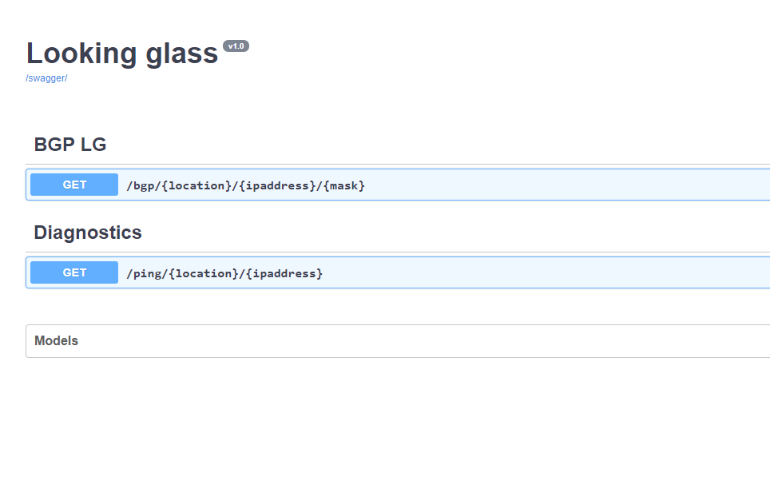

# Automation tools:

 **1- Jinja/Yaml/JSON render(Render):**
	
   This tool is written in _python_ and _HTML_, based on Flask module for web services.

 **2- Looking Glass API (+ SWAGGER UI):**

   This API is written in _python_ flask_restufl and _Swagger_, not entirely complete, but the main idea is to have an API 
   that can fetch the BGP parameters and attributes and return it to the requesters (web page, script, another 
   tool, etc..)

 **3- Cisco audit tool:**
   This is a pure CLI tool written in _python_ that can audit OLD DCN cisco routers and save results in CSV format that
   can be imported to Excel and show the results in a very decent format.


### Script librarys(sample):

```python
from flask import Flask
from flask_restful import Resource, Api
from apispec import APISpec
from marshmallow import Schema, fields
from apispec.ext.marshmallow import MarshmallowPlugin
from flask_apispec.extension import FlaskApiSpec
from flask_apispec.views import MethodResource
from flask_apispec import marshal_with, doc, use_kwargs
```

### Swagger example:

